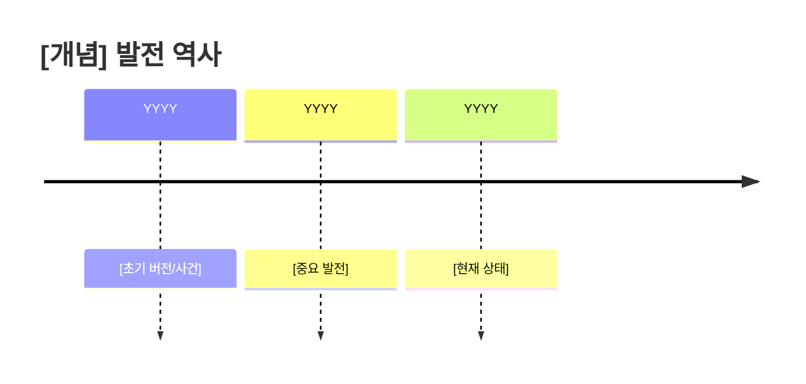
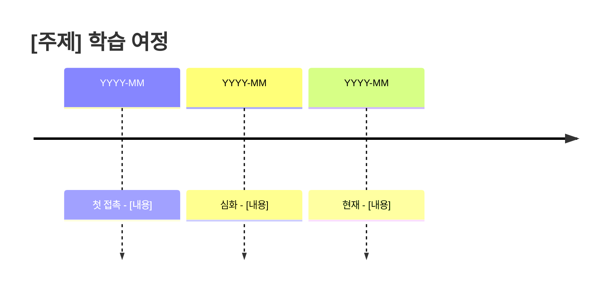

# 노트 템플릿 모음

## 노트 유형별 구조

### 1. 일반 Zettelkasten 노트 (풍부한 버전)

```markdown
---
id: YYYYMMDDHHmm
created: YYYY-MM-DDTHH:mm:ss
modified: YYYY-MM-DDTHH:mm:ss
tags: [주제1, 주제2, 키워드1, 키워드2]
status: evergreen | seedling | budding
confidence: high | medium | low
source_type: web | paper | book | video | personal
---

# [노트 제목]

> [!abstract] 한 줄 요약
> [이 노트의 핵심을 한 문장으로]

## 핵심 개념 (Core Concept)

[원자적 아이디어를 2-3문장으로 명확하게 설명]

**왜 중요한가?**
[이 개념이 왜 알아야 하는지, 어떤 문제를 해결하는지]

## 상세 설명 (Detailed Explanation)

### 배경 및 맥락
[개념이 등장한 배경, 역사적 맥락]
- 이전에는 어떻게 했는가?
- 왜 새로운 접근이 필요했는가?

### 정의와 핵심 원리
[개념의 정확한 정의]

> [!quote] 핵심 정의
> "[정의 인용]"

**핵심 원리:**
1. [원리 1]: 설명
2. [원리 2]: 설명
3. [원리 3]: 설명

### 구성 요소 / 구조
[개념의 하위 구성요소 분해]

```
[개념]
├── [구성요소 1]
│   ├── [하위요소 1-1]
│   └── [하위요소 1-2]
├── [구성요소 2]
└── [구성요소 3]
```

### 작동 방식 / 메커니즘
[어떻게 작동하는지 단계별 설명]
1. **Step 1**: [설명]
2. **Step 2**: [설명]
3. **Step 3**: [설명]

## 예시와 사례 (Examples & Cases)

### 구체적 예시
**예시 1: [제목]**
- 상황: [상황 설명]
- 적용: [어떻게 적용되는지]
- 결과: [결과]

**예시 2: [제목]**
- 상황: [상황 설명]
- 적용: [어떻게 적용되는지]
- 결과: [결과]

### 실제 사용 사례
| 사례 | 맥락 | 결과 |
|------|------|------|
| [사례1] | [맥락] | [결과] |
| [사례2] | [맥락] | [결과] |

## 비유와 직관 (Analogies & Intuition)

> [!tip] 직관적 이해
> [비유를 통한 설명 - 복잡한 개념을 익숙한 것에 빗대어]

**만약 ~라면:**
[다른 영역의 비유로 설명]

## 비교와 대조 (Comparison)

### vs [유사 개념 1]
| 측면 | 이 개념 | [유사 개념 1] |
|------|---------|---------------|
| [측면1] | [특징] | [특징] |
| [측면2] | [특징] | [특징] |
| 적합한 경우 | [상황] | [상황] |

### 언제 무엇을 선택?
- **이 개념 선택**: [조건]
- **대안 선택**: [조건]

## 장단점 분석 (Pros & Cons)

### 장점
- [장점 1]: 설명
- [장점 2]: 설명

### 단점 / 한계
- [단점 1]: 설명 + 완화 방법
- [단점 2]: 설명 + 완화 방법

### Trade-offs
- [Trade-off 1]: A를 얻으면 B를 잃는다
- [Trade-off 2]: ...

## 개인적 생각 (My Thoughts)

> [!note] 내 해석
> [이 개념에 대한 나만의 해석이나 관점]

**인상 깊었던 점:**
- [점 1]
- [점 2]

**의문점 / 비판:**
- [의문 1]
- [의문 2]

**내 경험과의 연결:**
[이전에 경험했거나 알고 있던 것과 어떻게 연결되는지]

## 실용적 적용 (Practical Applications)

### 적용 가능한 상황
- **상황 1**: [구체적 적용 방법]
- **상황 2**: [구체적 적용 방법]

### 시작하기 (Getting Started)
1. [첫 번째 단계]
2. [두 번째 단계]
3. [세 번째 단계]

### 주의사항 / 함정
- ⚠️ [주의사항 1]
- ⚠️ [주의사항 2]

## 생각해볼 질문 (Questions for Reflection)

### 이해 확인
- [ ] [핵심 개념을 내 말로 설명할 수 있는가?]
- [ ] [예시를 3개 이상 들 수 있는가?]

### 심화 질문
1. [깊이 있는 질문 1]
2. [깊이 있는 질문 2]
3. [아직 답하지 못한 질문]

### 탐구할 방향
- [다음에 알아볼 것 1]
- [다음에 알아볼 것 2]

## 연결된 개념 (Connected Concepts)

### 상위 개념 (Parent)
- [[상위개념노트]] - 이 개념이 속한 더 큰 범주

### 관련 개념 (Related)
- [[관련노트1]] - 연결 이유: [왜 관련있는지]
- [[관련노트2]] - 연결 이유: [왜 관련있는지]

### 하위 개념 (Children)
- [[하위개념노트1]] - 이 개념의 세부 사항
- [[하위개념노트2]] - 이 개념의 세부 사항

### 대조 개념 (Contrast)
- [[대조개념노트]] - 반대되거나 대안적인 개념

## 타임라인 / 발전 과정



## 참고문헌 (References)

### 주요 출처
- **원본**: [URL 또는 출처]
- **접근일**: YYYY-MM-DD
- **저자**: [저자명]

### 추가 학습 자료
- [추가 자료 1]: [링크/출처]
- [추가 자료 2]: [링크/출처]

### 관련 논문/글
- [논문/글 제목] - [간단한 설명]

---

> [!info] 메타 정보
> - **작성**: YYYY-MM-DD
> - **최종 수정**: YYYY-MM-DD
> - **검토 필요**: [예/아니오]
> - **확신도**: [높음/중간/낮음]
```

### 2. Map of Content (MOC) - 주제 허브 노트

```markdown
---
id: YYYYMMDDHHmm
created: YYYY-MM-DDTHH:mm:ss
tags: [주제, MOC, 관련키워드들]
type: map-of-content
---

# [주제] - Map of Content

## 개요 (Overview)

[주제에 대한 전체적인 요약]

---

## 핵심 개념 (Core Concepts)

1. **[[노트제목1]]**
   - 간단한 설명

2. **[[노트제목2]]**
   - 간단한 설명

---

## 방법론 (Methodology)

[해당되는 경우]

---

## 주요 발견 (Key Findings)

[해당되는 경우]

---

## 다른 주제와의 연결 (Connections to Other Topics)

- [[관련MOC1]] - 연결 설명
- [[관련노트1]] - 연결 설명

---

## 원문 정보 (Source Information)

- **저자**:
- **발표일**:
- **플랫폼**:
- **링크**:

---

## 전체적 질문 (Overarching Questions)

1. [주제 전반에 걸친 질문]

---

## 업데이트 이력 (Update History)

- YYYY-MM-DD: 초기 MOC 생성
```

### 2-1. 메인 MOC (3-Tier 구조용) ⭐ NEW

대용량 문서(연구보고서, 논문)를 체계적으로 정리할 때 사용하는 최상위 MOC입니다.

```markdown
---
created: YYYY-MM-DDTHH:mm:ss
tags: [MOC, 연구보고서, 주제]
type: main-moc
source: "[원본 출처 URL 또는 파일명]"
author: "[저자/기관명]"
published: YYYY-MM-DD
---

# [문서제목] - MOC

## 문서 개요

[문서 전체를 2-3문단으로 요약]

### 기본 정보

| 항목 | 내용 |
|------|------|
| 출처 | [URL/파일명] |
| 저자/기관 | [저자명] |
| 발행일 | YYYY-MM-DD |
| 정리일 | YYYY-MM-DD |

---

## 핵심 발견

1. **[발견 1]**: [한줄 설명]
2. **[발견 2]**: [한줄 설명]
3. **[발견 3]**: [한줄 설명]
4. **[발견 4]**: [한줄 설명]
5. **[발견 5]**: [한줄 설명]

---

## 챕터별 정리

### 1장. [[01-챕터명/챕터1-MOC|챕터1 제목]]
> [챕터1 한줄 요약]

**주요 원자 노트:**
- [[원자노트1]] - 요약
- [[원자노트2]] - 요약

---

### 2장. [[02-챕터명/챕터2-MOC|챕터2 제목]]
> [챕터2 한줄 요약]

**주요 원자 노트:**
- [[원자노트3]] - 요약
- [[원자노트4]] - 요약

---

### 3장. [[03-챕터명/챕터3-MOC|챕터3 제목]]
> [챕터3 한줄 요약]

---

## 전체 통계/데이터 요약

[문서 전체의 핵심 통계를 시각화]

```
[ASCII 차트 또는 테이블]
```

---

## 관련 자료

- [[관련문서-MOC]] - 연결 이유
- [[관련노트]] - 연결 이유

---

## 메모/인사이트

[이 문서를 읽고 든 개인적 생각]

---

## 📍 네비게이션

### 현재 위치
```
📚 [문서제목] ← 현재 보고 있는 문서
```

### 전체 목차
| # | 챕터 | 노트 수 |
|---|------|---------|
| 1 | [[01-챕터명/챕터1-MOC\|챕터1 제목]] | N개 |
| 2 | [[02-챕터명/챕터2-MOC\|챕터2 제목]] | N개 |
| 3 | [[03-챕터명/챕터3-MOC\|챕터3 제목]] | N개 |
| 4 | [[04-챕터명/챕터4-MOC\|챕터4 제목]] | N개 |
| 5 | [[05-챕터명/챕터5-MOC\|챕터5 제목]] | N개 |
```

### 2-2. 카테고리 MOC (3-Tier 구조용) ⭐ NEW

메인 MOC 하위의 챕터/섹션별 MOC입니다.

```markdown
---
created: YYYY-MM-DDTHH:mm:ss
tags: [MOC, 챕터명, 주제]
type: category-moc
parent: "[[메인-MOC]]"
chapter: N
---

# [챕터 제목] - MOC

> **상위**: [[메인-MOC|← 메인으로]]

## 개요

[챕터 내용을 1-2문단으로 요약]

---

## 핵심 내용

### [[원자노트1]]
> [한줄 요약]

**핵심 포인트:**
- 포인트 1
- 포인트 2

---

### [[원자노트2]]
> [한줄 요약]

**핵심 포인트:**
- 포인트 1
- 포인트 2

---

### [[원자노트3]]
> [한줄 요약]

**핵심 포인트:**
- 포인트 1
- 포인트 2

---

## 주요 데이터/통계

[이 챕터의 핵심 수치]

| 지표 | 수치 | 비고 |
|------|------|------|
| [지표1] | [값] | [설명] |
| [지표2] | [값] | [설명] |

---

## 관련 챕터

- [[다른챕터-MOC]] - [연결 이유]

---

## 📍 네비게이션

### 현재 위치
```
📚 [[메인-MOC|문서제목]]
  └── 📂 [현재 챕터명] ← 현재 보고 있는 챕터
```

### 이 챕터의 노트
| # | 노트 | 요약 |
|---|------|------|
| 1 | [[원자노트1]] | 요약 |
| 2 | [[원자노트2]] | 요약 |
| 3 | [[원자노트3]] | 요약 |

### 전체 목차
| # | 챕터 | 상태 |
|---|------|------|
| 1 | [[챕터1-MOC\|챕터1]] | ✅ 현재 |
| 2 | [[챕터2-MOC\|챕터2]] | ⬜ |
| 3 | [[챕터3-MOC\|챕터3]] | ⬜ |
| 4 | [[챕터4-MOC\|챕터4]] | ⬜ |
| 5 | [[챕터5-MOC\|챕터5]] | ⬜ |

---

← [[메인-MOC|메인으로]]
```

### 2-3. 원자적 노트 (3-Tier 구조용) ⭐ NEW

3-Tier 구조에서 가장 하위 레벨의 노트입니다. 단일 개념/데이터를 다룹니다.

```markdown
---
created: YYYY-MM-DDTHH:mm:ss
tags: [주제, 키워드1, 키워드2]
type: atomic
parent: "[[챕터-MOC]]"
source: "[원본 출처]"
chapter: N
---

# [개념/데이터 제목]

> **상위**: [[챕터-MOC|← 챕터로]] | [[메인-MOC|메인으로]]

## 핵심 내용

[2-3문장으로 핵심 설명]

---

## 상세 설명

[필요시 추가 설명]

### 배경/맥락
[왜 이 내용이 중요한지]

### 세부 사항
[구체적인 내용]

---

## 데이터/근거

[통계, 인용, 차트 등]

```
[ASCII 차트 또는 테이블]
```

| 항목 | 수치 | 비고 |
|------|------|------|
| [항목1] | [값] | [설명] |

---

## 시사점

[이 데이터/개념이 의미하는 바]

---

## 관련 노트

- [[관련노트1]] - [연결 이유]
- [[관련노트2]] - [연결 이유]

---

## 📍 네비게이션

### 현재 위치
```
📚 [[메인-MOC|문서제목]]
  └── 📂 [[챕터-MOC|현재 챕터명]]
        └── 📄 [현재 노트 제목] ← 현재 보고 있는 노트
```

### 같은 챕터의 노트
| # | 노트 | 상태 |
|---|------|------|
| 1 | [[원자노트1]] | ⬜ |
| 2 | [[원자노트2]] | ✅ 현재 |
| 3 | [[원자노트3]] | ⬜ |

### 전체 목차
| # | 챕터 | 현재 |
|---|------|------|
| 1 | [[챕터1-MOC\|챕터1]] | ✅ |
| 2 | [[챕터2-MOC\|챕터2]] | ⬜ |
| 3 | [[챕터3-MOC\|챕터3]] | ⬜ |
| 4 | [[챕터4-MOC\|챕터4]] | ⬜ |
| 5 | [[챕터5-MOC\|챕터5]] | ⬜ |

---

← [[챕터-MOC|챕터로]] | [[메인-MOC|메인으로]]
```

### 3. 도구/제품 노트

```markdown
---
created: YYYY-MM-DDTHH:mm:ssZ
modified: YYYY-MM-DDTHH:mm:ss.sssZ
id: YYYYMMDD-HHmm-NN
tags:
  - "#개념/AI/[분야]"
  - "#개념/도구/[유형]"
  - "#유형/정의"
  - "#출처/[출처유형]"
type: zettelkasten
---

# [도구명] - [한줄 설명]

## 핵심 내용

[도구의 핵심 기능과 특징을 간결하게]

**핵심 특징:**
- 특징 1
- 특징 2
...

**설계 철학:**
[도구의 설계 의도나 철학]

## 연결된 노트

- [[관련노트1]] - 연결 이유
- [[관련노트2]] - 연결 이유

## 적용 사례

**적합한 경우:**
- 사례 1
- 사례 2

**부적합한 경우:**
- 사례 1
- 사례 2

## 참고사항

**출처:** [출처]
**평가 점수:** (해당시)

## 발전 가능성

- 향후 예상되는 발전 방향
```

### 4. 인사이트 노트 (Insight Note) - NEW!

여러 노트에서 도출된 새로운 통찰을 기록하는 노트

```markdown
---
id: YYYYMMDDHHmm
created: YYYY-MM-DDTHH:mm:ss
tags: [insight, 주제1, 주제2]
type: insight
source_notes: ["[[노트1]]", "[[노트2]]", "[[노트3]]"]
confidence: high | medium | low
---

# [인사이트 제목]

> [!lightbulb] 핵심 인사이트
> [도출된 인사이트를 한 문장으로]

## 인사이트 요약

[인사이트의 핵심 내용을 2-3 문단으로]

## 발견 과정

### 연결된 점들
[어떤 노트들에서 어떤 패턴을 발견했는지]

| 노트 | 핵심 기여 | 연결 포인트 |
|------|----------|-------------|
| [[노트1]] | [기여 내용] | [연결점] |
| [[노트2]] | [기여 내용] | [연결점] |
| [[노트3]] | [기여 내용] | [연결점] |

### 발견의 계기
[무엇이 이 인사이트를 촉발했는지]

## 인사이트 상세

### 핵심 주장
1. **[주장 1]**: [근거와 설명]
2. **[주장 2]**: [근거와 설명]
3. **[주장 3]**: [근거와 설명]

### 근거와 증거
- **근거 1**: [[출처노트]] - [내용]
- **근거 2**: [[출처노트]] - [내용]

### 반론 / 한계
- [가능한 반론]: [대응]
- [한계점]: [향후 보완 방향]

## 함의와 적용

### 이론적 함의
[이 인사이트가 기존 이해를 어떻게 확장하는지]

### 실천적 함의
[실제로 어떻게 적용할 수 있는지]
1. [적용 방안 1]
2. [적용 방안 2]

### 후속 질문
- [ ] [탐구할 질문 1]
- [ ] [탐구할 질문 2]

## 메타 정보

- **인사이트 유형**: 연결 발견 | 패턴 인식 | 모순 해소 | 새로운 관점
- **확신도**: 높음 | 중간 | 낮음
- **검증 상태**: 가설 | 부분 검증 | 검증됨

## 관련 노트

### 출처 노트
- [[노트1]] - 핵심 기여
- [[노트2]] - 핵심 기여

### 후속 노트
- [[후속탐구노트]] - 이 인사이트에서 파생된 탐구

---

> [!info] 생성 정보
> - 생성일: YYYY-MM-DD
> - 분석 노트 수: N개
> - 마지막 검토: YYYY-MM-DD
```

### 5. 지식 종합 노트 (Knowledge Synthesis Note) - NEW!

특정 주제에 대한 여러 노트를 종합한 노트

```markdown
---
id: YYYYMMDDHHmm
created: YYYY-MM-DDTHH:mm:ss
tags: [synthesis, 주제, MOC]
type: knowledge-synthesis
analyzed_notes: N
date_range: "YYYY-MM ~ YYYY-MM"
---

# [주제] - 지식 종합

> [!abstract] 종합 요약
> [이 주제에 대해 알고 있는 것의 핵심을 2-3문장으로]

## 메타 정보

| 항목 | 내용 |
|------|------|
| 종합 일시 | YYYY-MM-DD HH:mm |
| 분석된 노트 수 | N개 |
| 기간 | YYYY-MM ~ YYYY-MM |
| 주요 카테고리 | [카테고리들] |

## 핵심 발견 (Key Findings)

### 1. [발견 1 제목]
[발견 내용]
- 근거: [[노트1]], [[노트2]]
- 확신도: 높음/중간/낮음

### 2. [발견 2 제목]
[발견 내용]
- 근거: [[노트3]], [[노트4]]
- 확신도: 높음/중간/낮음

### 3. [발견 3 제목]
...

## 주제별 정리

### [하위 주제 1]

#### 핵심 내용
[종합된 내용]

#### 관련 노트
- [[노트A]] - 기여: [내용]
- [[노트B]] - 기여: [내용]

#### 나의 이해
[이 하위 주제에 대한 나의 현재 이해]

---

### [하위 주제 2]
...

## 발견된 패턴

### 반복되는 주제
1. **[패턴 1]**: [설명] - 등장 노트: [[노트들]]
2. **[패턴 2]**: [설명] - 등장 노트: [[노트들]]

### 흥미로운 연결
```
[[노트X]] ←→ [[노트Y]]
     │
     └── 연결 이유: [설명]
```

### 긴장점 / 모순
| 관점 A | 관점 B | 나의 해석 |
|--------|--------|-----------|
| [내용] | [내용] | [해석] |

## 지식 격차 (Knowledge Gaps)

### 아직 모르는 것
- [ ] [질문 1]: 관련 노트 [[노트]]
- [ ] [질문 2]: 탐구 필요

### 더 깊이 파야 할 것
- [ ] [주제 1]: 현재 이해도 30%
- [ ] [주제 2]: 현재 이해도 50%

### 다음 학습 방향
1. [방향 1]: [이유]
2. [방향 2]: [이유]

## 시간에 따른 이해 변화



### 이해의 진화
| 시점 | 이해 수준 | 주요 변화 |
|------|----------|-----------|
| 초기 | [수준] | [내용] |
| 중기 | [수준] | [내용] |
| 현재 | [수준] | [내용] |

## 실천 항목 (Action Items)

### 즉시 할 것
- [ ] [항목 1]
- [ ] [항목 2]

### 나중에 할 것
- [ ] [항목 1]
- [ ] [항목 2]

### 장기 목표
- [ ] [목표 1]

## 원본 노트 목록

### 핵심 노트 (Most Important)
| 노트 | 핵심 기여 | 작성일 |
|------|----------|--------|
| [[노트1]] | [기여] | YYYY-MM-DD |
| [[노트2]] | [기여] | YYYY-MM-DD |

### 보조 노트 (Supporting)
| 노트 | 역할 | 작성일 |
|------|------|--------|
| [[노트3]] | [역할] | YYYY-MM-DD |
| [[노트4]] | [역할] | YYYY-MM-DD |

## 관련 MOC / 종합 노트
- [[관련 MOC 1]] - 연결: [관계]
- [[관련 종합 노트]] - 연결: [관계]

---

> [!info] 종합 정보
> - **종합 유형**: 주제 정리 | 트렌드 분석 | 질문 답변
> - **다음 종합 예정**: YYYY-MM-DD
> - **업데이트 필요**: 예/아니오
```
